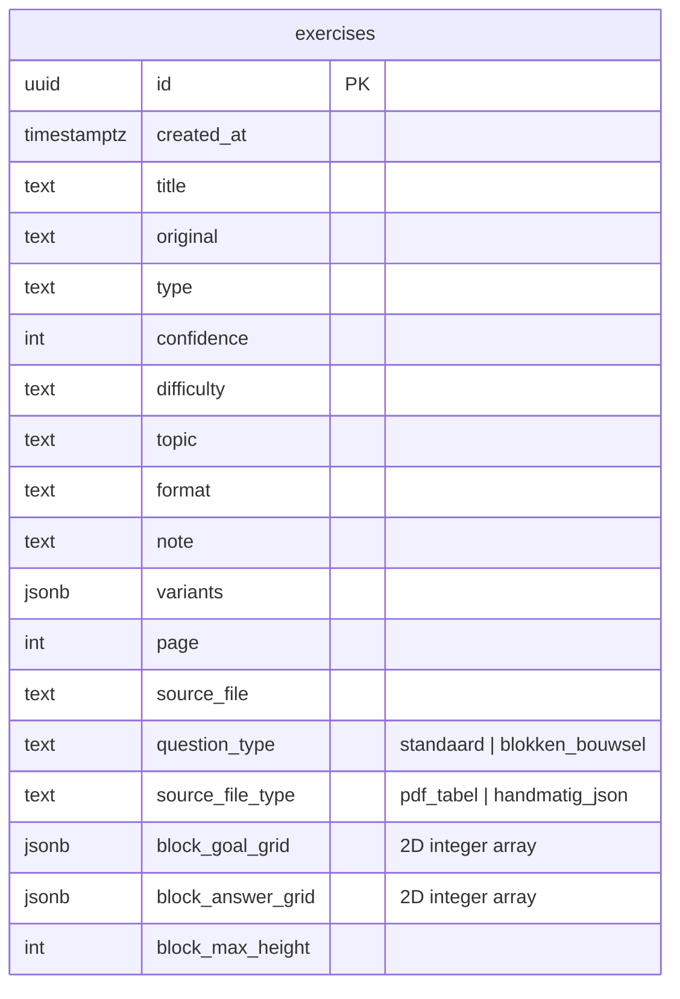

# Database diagram: blokkenbouwsel (Pilot 1 - groep 3)

Dit diagram toont hoe het vraagtype `blokken_bouwsel` wordt opgeslagen binnen de bestaande tabel `exercises`.



## Semantiek van velden

- `question_type`: functionele classificatie. Voor dit pilot-type is dit `blokken_bouwsel`.
- `source_file_type`: bron van de opdracht (`pdf_tabel` of `handmatig_json`).
- `block_goal_grid`: doelbouwsel als 2D-array van hoogtes.
- `block_answer_grid`: leerlingantwoord als 2D-array van hoogtes (optioneel).
- `block_max_height`: maximale toegestane hoogte per cel (standaard 5).

## JSON-voorbeeld

```json
{
  "question_type": "blokken_bouwsel",
  "source_file_type": "handmatig_json",
  "block_goal_grid": [
    [2, 1, 3],
    [0, 2, 1]
  ],
  "block_answer_grid": [
    [2, 1, 2],
    [0, 2, 1]
  ],
  "block_max_height": 5
}
```

## Validatie in SQL

In de migratie zijn constraints toegevoegd die afdwingen dat:

- `question_type` alleen `standaard` of `blokken_bouwsel` is.
- `source_file_type` alleen `pdf_tabel` of `handmatig_json` is (of null voor standaard-opgaven).
- Voor `blokken_bouwsel` moet `block_goal_grid` gevuld en valide zijn.
- Grid-waarden integers tussen `0` en `block_max_height` bevatten.

```

```
